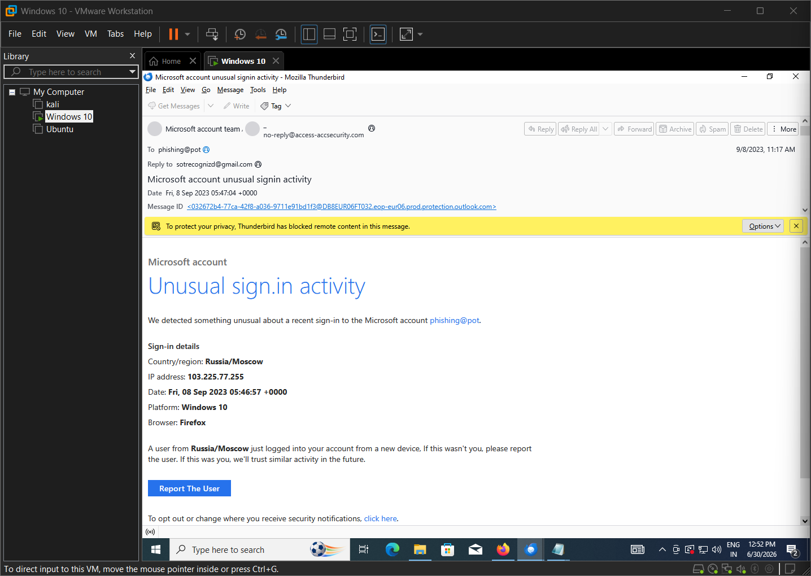
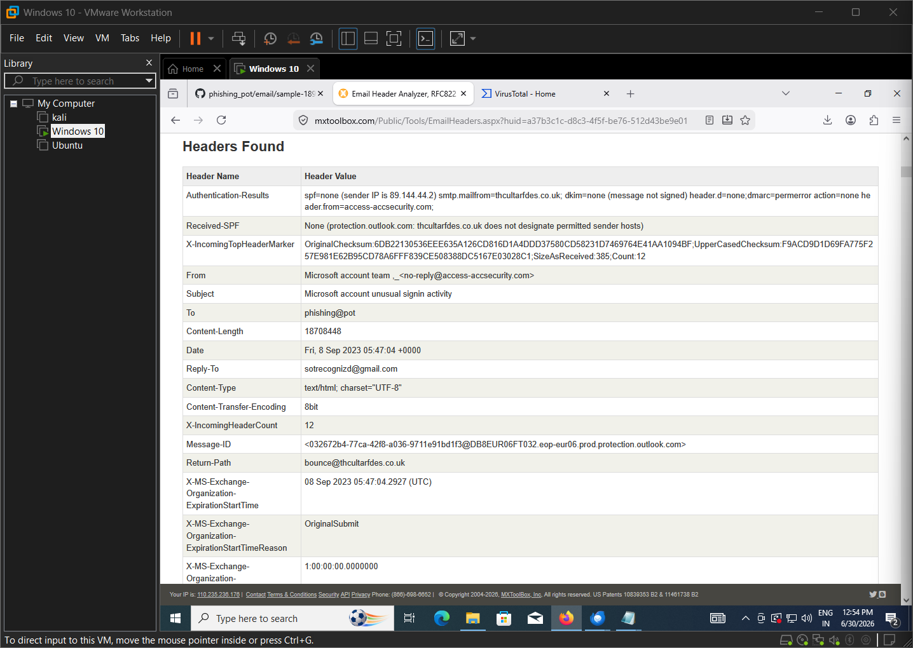
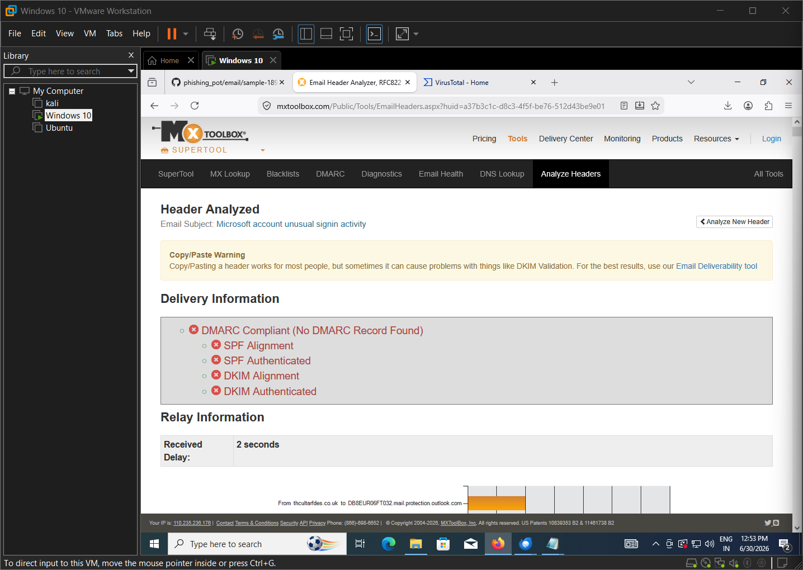
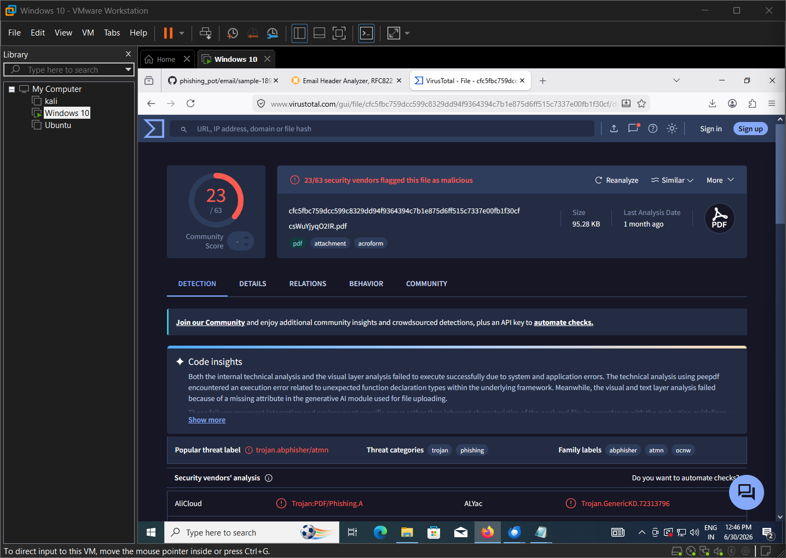
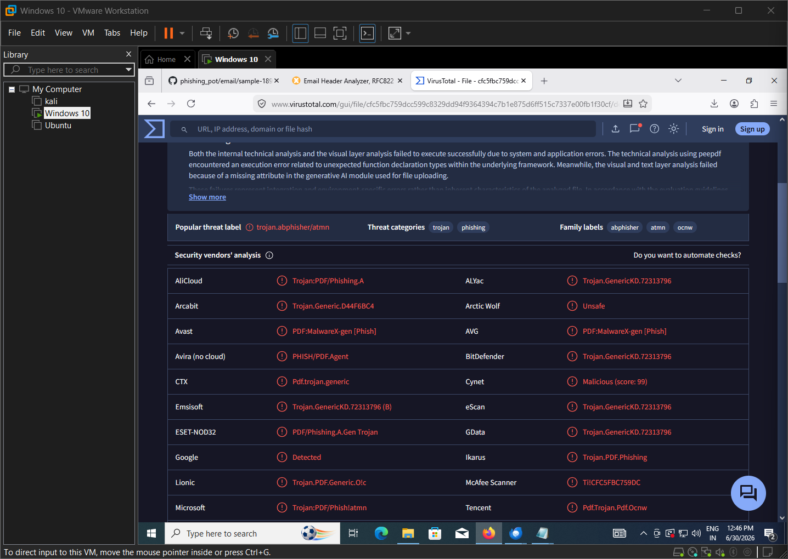
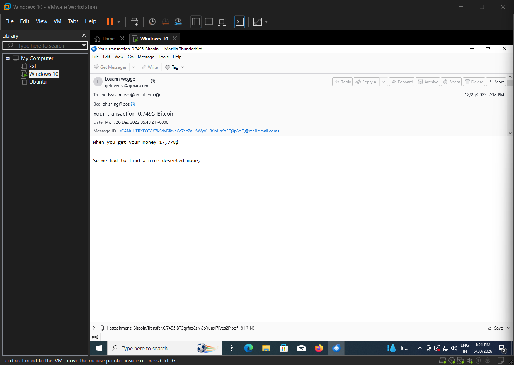
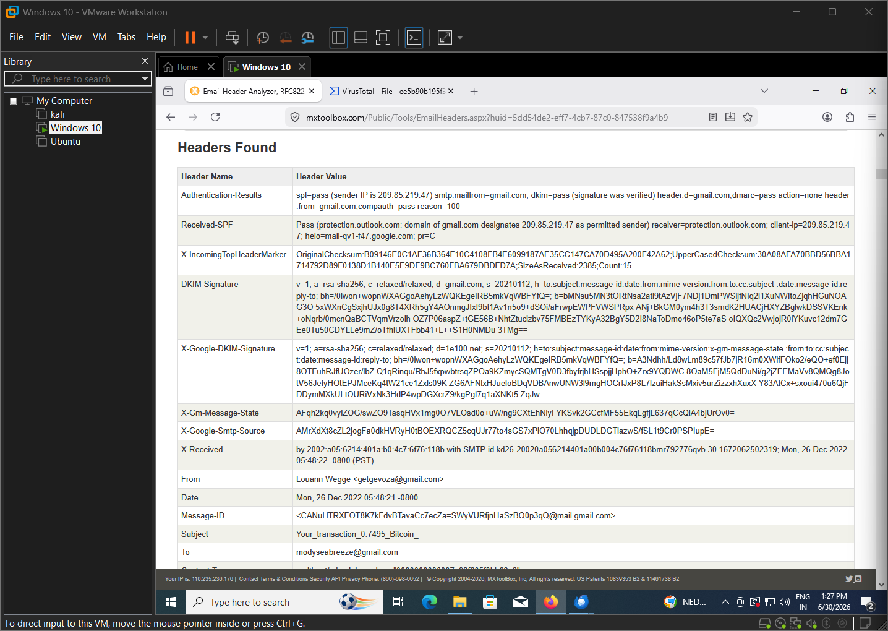
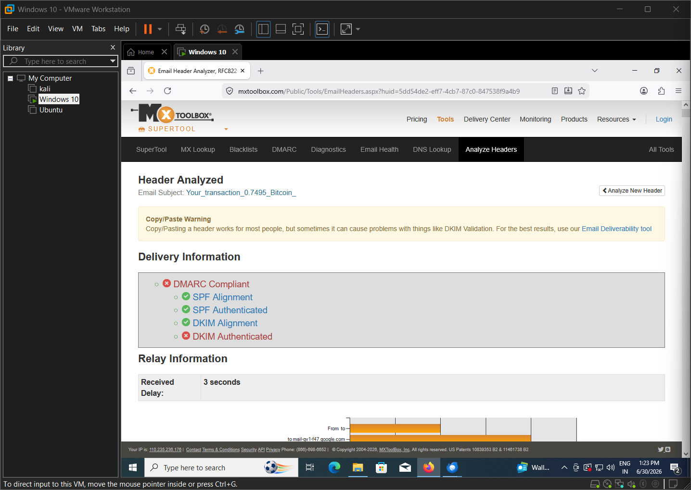
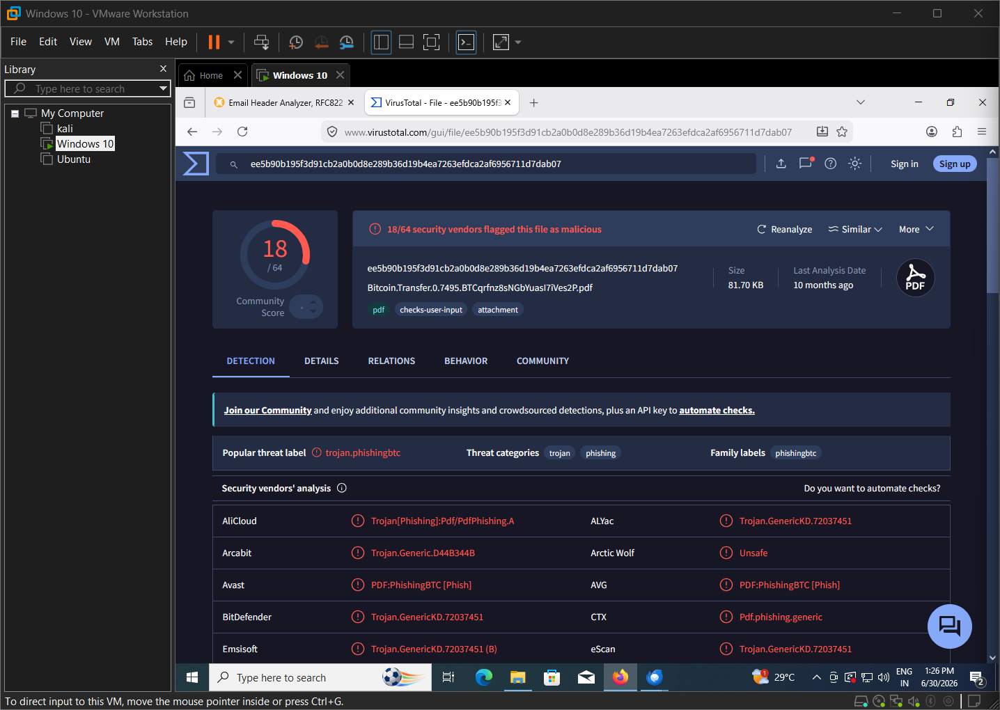

# Phishing Email Analysis Lab

## Overview

Phishing remains one of the most common attack techniques used by cybercriminals to steal credentials, distribute malware, and compromise user accounts.

In this lab, I investigated two phishing email samples inside an isolated Windows 10 virtual machine. Rather than relying on a single indicator, I analyzed email headers, validated SPF, DKIM, and DMARC authentication, inspected suspicious PDF attachments, and used VirusTotal to determine whether each email was malicious.

The goal of this project was to follow a structured investigation process similar to the workflow used by a Security Operations Center (SOC) analyst when triaging phishing incidents.

---
## Project Summary

- **Phishing Samples Investigated:** 2
- **Credential Phishing Samples:** 1
- **Malicious Attachments Analyzed:** 1
- **Malicious URLs Analyzed:** 1
- **Threat Intelligence Platform:** VirusTotal
- **Header Analysis Tool:** MXToolbox
- **Operating System:** Windows 10 VM

## Attack Summary

| Sample   | Theme                    | Attack Type         | Payload               |
| -------- | ------------------------ | ------------------- | --------------------- |
| Sample 1 | Microsoft Security Alert | Credential Phishing | Malicious URL         |
| Sample 2 | Bitcoin Transaction      | Financial Phishing  | Trojan PDF Attachment |

## Objectives

- Analyze suspicious phishing emails
- Examine email headers
- Verify SPF, DKIM, and DMARC authentication
- Identify sender anomalies
- Analyze suspicious attachments
- Extract Indicators of Compromise (IOCs)
- Document findings and recommended actions

---

## Lab Environment

| Component | Details |
|-----------|----------|
| Operating System | Windows 10 Virtual Machine |
| Virtualization | VMware Workstation |
| Email Client | Mozilla Thunderbird |
| Header Analysis | MXToolbox |
| Malware Analysis | VirusTotal |

---
## Tools Used

- Mozilla Thunderbird
- MXToolbox Email Header Analyzer
- VirusTotal
- VMware Workstation
- Windows 10 Virtual Machine
## Investigation Process

The investigation followed a structured workflow for both phishing samples:

1. Opened the suspicious email in Mozilla Thunderbird.
2. Reviewed the sender, subject, and email content.
3. Extracted the complete email header.
4. Analyzed SPF, DKIM, and DMARC using MXToolbox.
5. Examined the sender and Reply-To addresses.
6. Investigated the phishing URL or attachment using VirusTotal.
7. Collected indicators of compromise (IOCs).
8. Documented the findings and assigned a final verdict.

---
## Sample 1 – Microsoft Account Phishing

### Incident Summary

The first email impersonated Microsoft's security team and claimed that unusual sign-in activity had been detected on the recipient's account. The objective of the email was to create urgency and convince the victim to open the attached malicious link without questioning its legitimacy.

### Email

### Header Analysis

### MXToolbox Results

### VirusTotal Analysis

### Detection Results

### Investigation Findings

The embedded URL was safely extracted from the email and analyzed using VirusTotal without visiting the destination. VirusTotal reported that one or more security vendors classified the URL as phishing, indicating that the link could be used to redirect victims to a fraudulent website designed to steal credentials.

Combined with the failed SPF, DKIM, and DMARC checks, the analysis strongly indicated that the email was a credential phishing attempt.

### Risk Assessment

**Severity:** High

**Reason**

- Uses social engineering to manipulate the recipient.
- Contains a malicious phishing URL.
- Attempts to steal Microsoft account credentials.
- VirusTotal classified the embedded URL as suspicious.

## Phishing URL Analysis

The email contained a malicious URL disguised as a Microsoft security notification. Instead of delivering malware directly, the attacker attempted to redirect the victim to a phishing website.

Credential phishing attacks typically use fake login pages that closely resemble legitimate Microsoft sign-in portals. If a victim enters their username and password, the credentials are sent directly to the attacker.

These attacks rely heavily on urgency and trust rather than malware, making careful inspection of email authentication records and URLs essential during an investigation.

Based on the failed email authentication checks, suspicious sender information, and VirusTotal URL analysis, this email was classified as a **Credential Phishing Attack using a malicious phishing URL**.
## Sample 2 – Bitcoin Transaction Phishing

### Incident Summary

Unlike the first sample, this email did not impersonate Microsoft. Instead, it attempted to attract the victim's attention by claiming that a Bitcoin transaction had been received. This is a common social engineering technique used to exploit curiosity and financial interest.

### Email

### Header Analysis

### MXToolbox Results

### VirusTotal Analysis

### Investigation Findings

The email contained a PDF attachment that was submitted to VirusTotal. Multiple security vendors identified the attachment as malicious and associated it with Trojan-based phishing activity.

Unlike the Microsoft sample, the attacker relied on a cryptocurrency-themed lure rather than a fake security notification. This demonstrates that phishing campaigns use different social engineering techniques while pursuing the same objective: persuading users to interact with malicious content.

Based on the attachment analysis and supporting threat intelligence, the email was classified as a **Financial Phishing Attack using a Trojan PDF attachment**.

---
### Risk Assessment

**Severity:** High

**Reason**

- Uses social engineering to manipulate the recipient.
- Delivers a malicious PDF attachment.
- Can lead to credential theft or malware infection.

## Indicators of Compromise (IOCs)

| Indicator | Sample 1 | Sample 2 |
|-----------|----------|----------|
| Sender | Suspicious | Suspicious |
| Subject | Microsoft Account Alert | Bitcoin Transaction |
| Payload | Malicious URL | Malicious PDF |
| Threat | Credential Phishing | Trojan PDF |
| SPF | Failed | Passed |
| DKIM | Failed | Passed |
| DMARC | Failed | Failed |
| VirusTotal | URL Analysis | 18/64 Detection |

The phishing emails were mapped to the MITRE ATT&CK framework based on the techniques observed during the investigation.

## MITRE ATT&CK Mapping

| Technique | ATT&CK ID | Description |
|-----------|-----------|-------------|
| Phishing | T1566 | Initial Access through phishing emails |
| Spearphishing Attachment | T1566.001 | Malicious PDF attachment |
| User Execution | T1204 | User opens malicious attachment |
| Masquerading | T1036 | Microsoft brand impersonation |

---

# Security Recommendations

- Verify the sender before opening unexpected attachments.
- Check SPF, DKIM, and DMARC authentication failures.
- Scan suspicious attachments using multiple security engines.
- Report phishing emails to the security team.
- Enable Multi-Factor Authentication (MFA).
- Avoid clicking links or opening attachments from unsolicited emails.

---
## Lessons Learned

Working on this project helped me understand that phishing detection is not based on a single indicator. A message may appear legitimate, and in some cases even pass certain authentication checks, while still delivering malicious content.

This investigation reinforced the importance of combining header analysis, email authentication, attachment analysis, and threat intelligence before determining whether an email is safe.

## Skills Demonstrated

- Email Header Analysis
- Email Authentication (SPF, DKIM, DMARC)
- IOC Extraction
- Threat Intelligence
- Malware Analysis
- Attachment Analysis
- VirusTotal Investigation
- MXToolbox Analysis
- Phishing Detection
- Incident Documentation
- SOC Investigation Workflow
---
## Key Takeaways

- Phishing emails can use different themes while pursuing the same objective.
- Email authentication alone is not enough to determine legitimacy.
- Attachment analysis is a critical step during phishing investigations.
- Combining multiple sources of evidence improves detection accuracy.
- Threat intelligence platforms provide valuable context but should be used alongside header analysis.

# Conclusion

This project gave me practical experience in investigating phishing emails using a structured SOC analysis workflow. By analyzing two different phishing campaigns, I learned how attackers use different social engineering techniques to achieve the same goal—convincing users to interact with malicious content.
The first sample impersonated Microsoft's security team to create fear and urgency by directing victims to a malicious phishing URL, while the second used a fake Bitcoin transaction to exploit curiosity and deliver a malicious PDF attachment. Although the attack techniques were different, both campaigns relied on social engineering to persuade users to interact with malicious content.

Throughout the investigation, I analyzed email headers, verified SPF, DKIM, and DMARC authentication, examined suspicious attachments, and extracted indicators of compromise (IOCs). Combining these techniques helped me accurately determine that both emails were malicious.

This project strengthened my understanding of phishing analysis, email security, and threat investigation while providing hands-on experience with tools and techniques commonly used by SOC analysts during phishing triage and incident response.

## Future Improvements

This project can be extended by:

- Analyzing additional phishing email samples.
- Performing sandbox analysis of malicious attachments.
- Creating Sigma detection rules for phishing indicators.
- Automating IOC extraction using Python.
- Integrating phishing analysis with a SIEM platform such as Splunk or Microsoft Sentinel.

## Disclaimer

This project was completed for educational and defensive cybersecurity purposes only. All phishing samples were analyzed in an isolated virtual machine. No malicious attachments or live phishing infrastructure are redistributed through this repository.

## 👨‍💻 Author

**Abhiram Rapothula**

Cybersecurity Graduate | SOC Analyst Enthusiast

- GitHub: [abhiramyadav03](https://github.com/abhiramyadav03)
- LinkedIn: [rapothulaabhiram](https://linkedin.com/in/rapothulaabhiram)
- TryHackMe: [rapothula1907](https://tryhackme.com/p/rapothula1907)
